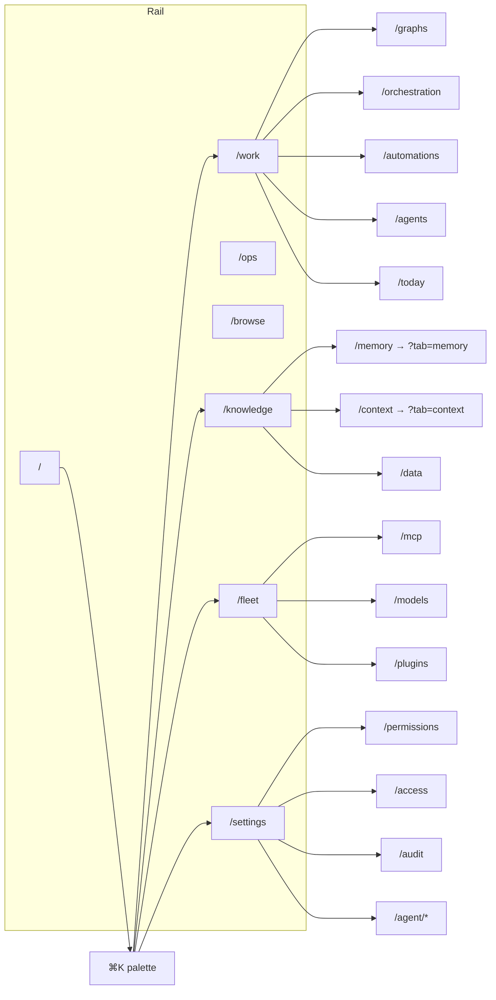
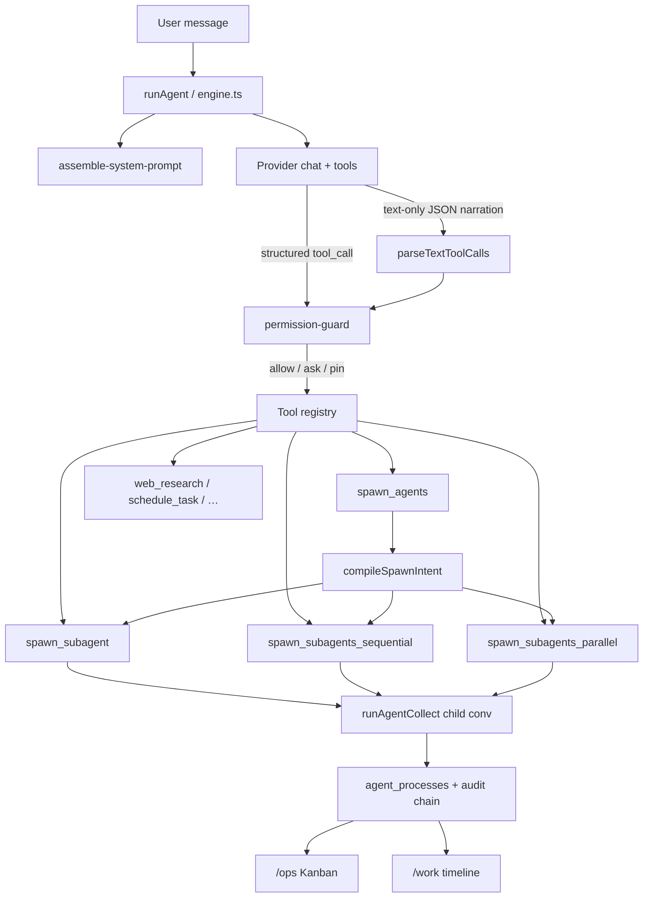
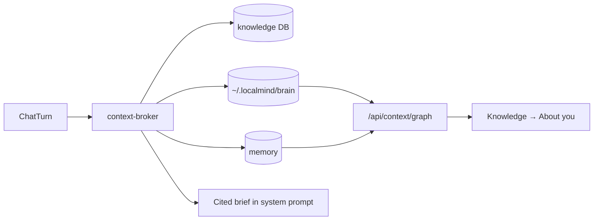
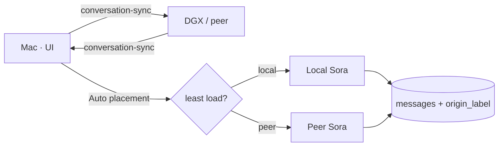

# LocalMind architecture & surface map

Code graph of how UI, agent loop, tools, and data connect. Keep this in sync
when adding pages, tools, or spawn modes.

## Product surface (navigation)

Primary nav is the **rail** (`src/components/rail.tsx`). Long-tail destinations
are reached via **⌘K** (`command-palette.tsx`) and the **settings sidebar**
(`settings-sidebar.tsx`).

## Agent loop & spawn

| Spawn tool | Concurrency | Use when |
|---|---|---|
| `spawn_agents` | inferred | Preferred; mode from batch size + prose |
| `spawn_subagent` | 1 child | B needs A's output (chain) |
| `spawn_subagents_sequential` | 1 at a time over a batch | Independent units; spare RAM |
| `spawn_subagents_parallel` | Governor-capped | Independent units; wall-clock speedup |

`agent_mode` (`auto` default / `plan` / `ask`) overlays the permission guard.
Destructive actions always confirm.

## Data & retrieval

## Config schema

Config DB migrations live in `src/lib/db/migrations.ts`. Current notable
versions:

| Ver | Change |
|-----|--------|
| v27 | Sora `enabled_tools` backfill (`schedule_task`, `recall`, browse, …) |
| v28 | Default `agent_mode` → `auto` |
| v29 | Grant `spawn_subagents_sequential` to Sora |
| v30 | Fleet mesh conversation-sync policy default |
| v31 | Grant `spawn_agents`, `agent_memory`, `install_mcp_server` |

## Fleet mesh (LAN)

Paired devices can share one chat timeline and split compute:

- **Sync** — `sync_conversations` peer policy (default on). Push/pull via fleet envelope `conversation-sync`. Each message keeps `origin_node_id` / `origin_label`. Image attachments sync under a 256 KiB budget (validated `image/*` only).
- **Attribution** — chat UI shows `from …` / `via …` per turn.
- **Compute** — chat **Run on** defaults to **Auto** when peers are paired; placement prefers peers advertising `accepts_chat_relay`. Task-graph collect path uses `createPlacementRunner` (local fallback when alone).
- **Remote drive** — relay SSE surfaces progressive status (`Waiting on…` / `Receiving…`); `accept_chat_relay` still required on the executor.