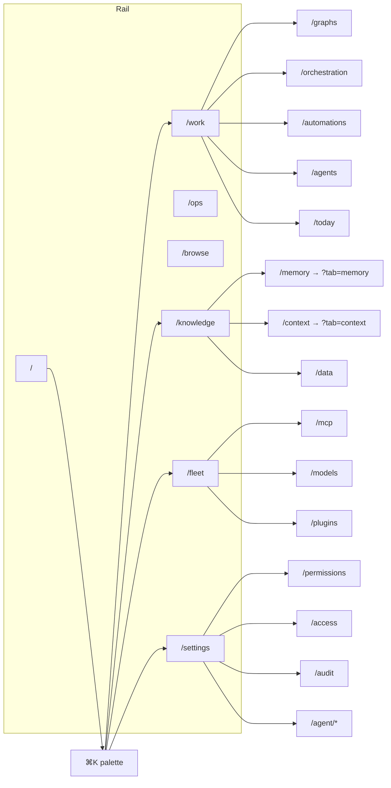
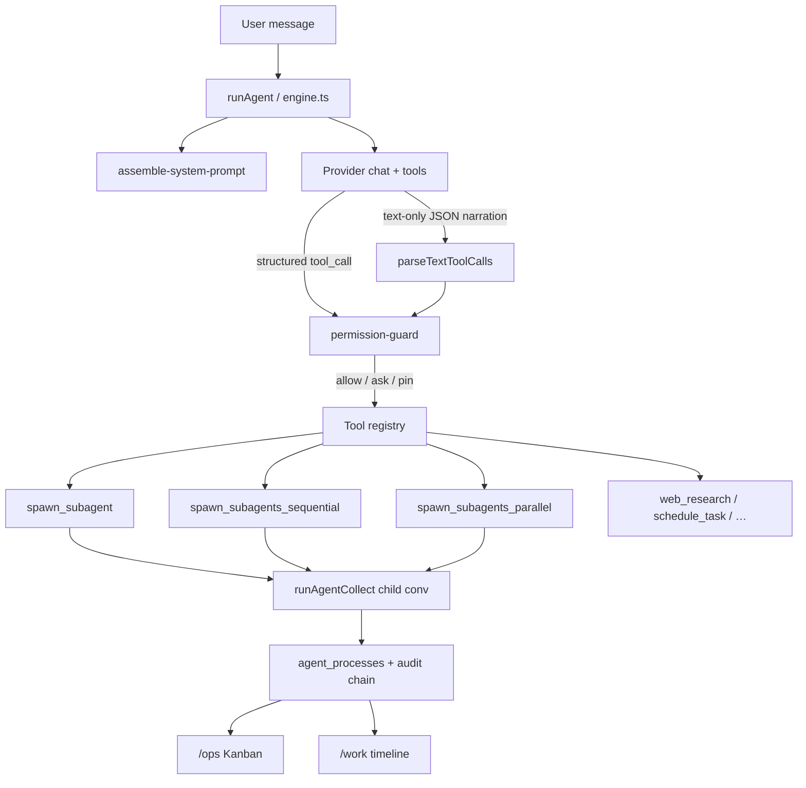
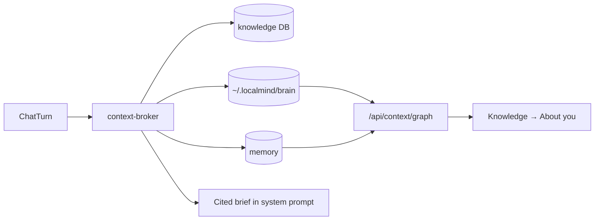

# LocalMind architecture & surface map

Code graph of how UI, agent loop, tools, and data connect. Keep this in sync
when adding pages, tools, or spawn modes.

## Product surface (navigation)

Primary nav is the **rail** (`src/components/rail.tsx`). Long-tail destinations
are reached via **⌘K** (`command-palette.tsx`) and the **settings sidebar**
(`settings-sidebar.tsx`). Legacy `MainNav` / `MobileNav` are unused.

## Agent loop & spawn

| Spawn tool | Concurrency | Use when |
|---|---|---|
| `spawn_subagent` | 1 child | B needs A's output (chain) |
| `spawn_subagents_sequential` | 1 at a time over a batch | Independent units; spare RAM (default for multi-unit) |
| `spawn_subagents_parallel` | Governor-capped | Independent units; wall-clock speedup |

`agent_mode` (`auto` default / `plan` / `ask`) overlays the permission guard.
Destructive actions always confirm.

## Data & retrieval

## Config schema

Config DB migrations live in `src/lib/db/migrations.ts`. Current notable
versions:

| Ver | Change |
|-----|--------|
| v27 | Sora `enabled_tools` backfill (`schedule_task`, `recall`, browse, …) |
| v28 | Default `agent_mode` → `auto` |
| v29 | Grant `spawn_subagents_sequential` to Sora |

## Auth

Every `src/app/api/**/route.ts` is covered by `src/lib/auth/route-map.ts`
(unmapped routes default to owner). Share-policy owner routes must stay
**above** the `/api/knowledge/*` wildcard.
