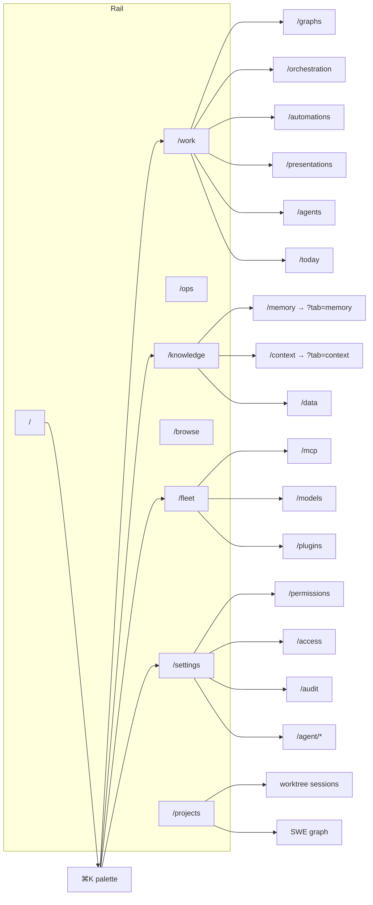
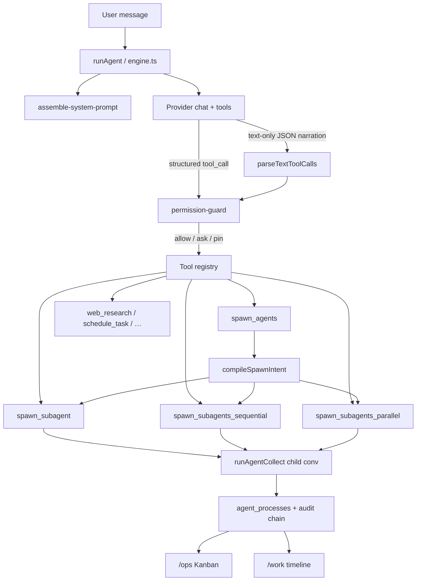
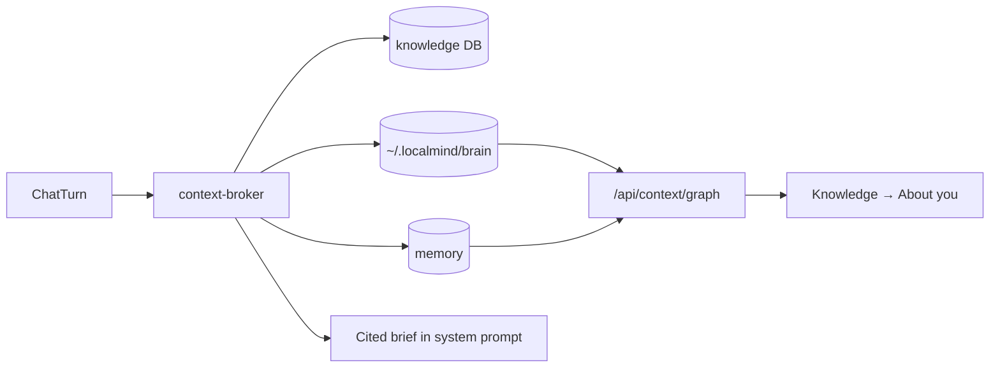
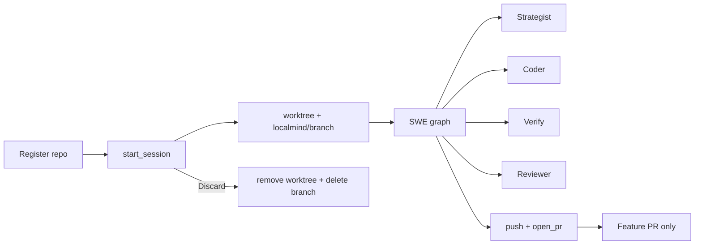
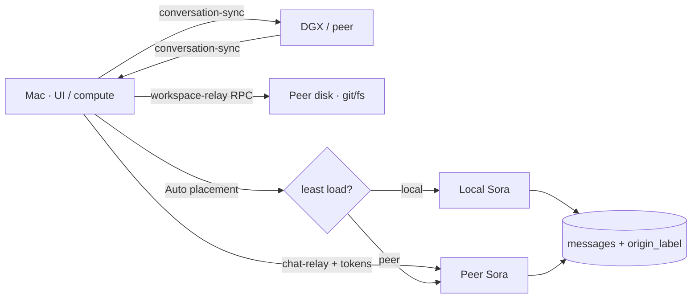

# LocalMind architecture & surface map

Code graph of how UI, agent loop, tools, and data connect. Keep this in sync
when adding pages, tools, or spawn modes.

**PRDs:** [Sora v2](./PRD-sora-v2.md) ([status](./sora-v2-implementation.md)) · [Personal Assistant v3](./PRD-personal-assistant-v3.md) ([status](./personal-assistant-v3-implementation.md)) · [Mesh depth v4](./PRD-mesh-depth-v4.md) ([status](./mesh-depth-v4-implementation.md))

## Product surface (navigation)

Primary nav is the **rail** (`src/components/rail.tsx`). Long-tail destinations
are reached via **⌘K** (`command-palette.tsx`) and the **settings sidebar**
(`settings-sidebar.tsx`).

## Agent loop & spawn

| Spawn tool | Concurrency | Use when |
|---|---|---|
| `spawn_agents` | inferred | Preferred; mode from batch size + prose |
| `spawn_subagent` | 1 child | B needs A's output (chain) |
| `spawn_subagents_sequential` | 1 at a time over a batch | Independent units; spare RAM |
| `spawn_subagents_parallel` | Governor-capped | Independent units; wall-clock speedup |

`agent_mode` (`auto` default / `plan` / `ask`) overlays the permission guard.
Destructive actions always confirm.

## Data & retrieval

## Config schema

Config DB migrations live in `src/lib/db/migrations.ts`. Current notable
versions:

| Ver | Change |
|-----|--------|
| v27 | Sora `enabled_tools` backfill (`schedule_task`, `recall`, browse, …) |
| v28 | Default `agent_mode` → `auto` |
| v29 | Grant `spawn_subagents_sequential` to Sora |
| v30 | Fleet mesh conversation-sync policy default |
| v31 | Grant `spawn_agents`, `agent_memory`, `install_mcp_server` |
| v32 | `coding_projects` / `coding_sessions`; grant `coding_project`, `git`, `pi_code` |
| v33 | Personas may pin `provider` with `model_name` |
| v34 | Grant `manage_workflow` to Sora |
| v35 | `presentations` table + grant `presentation` |
| v36 | Settings `compute_placement` / `workspace_placement` |
| v37 | Coding session `compute_peer_id` / `workspace_peer_id` |
| v38 | Optional `code_server_enabled` / `code_server_url` |

## Coding projects (autonomous SWE)

Undoable coding sessions use **git worktrees** under `~/.localmind/workspaces/`:

- Tools: `coding_project`, `git` (refuses push to main/master), `pi_code` / `filesystem` scoped via `coding_session_id` (engine injects worktree `approvedDirs` for the whole turn)
- UI: `/projects` (+ Electron secondary coding window); Ops cards link Projects / PR / Discard
- Gate 2: approved Ops proposals → session + SWE loop when a project is registered
- Tests: `__tests__/coding-worktree.test.ts`, `__tests__/swe-graph.test.ts`, `__tests__/gate2.test.ts`
## Fleet mesh (LAN)

Paired devices can share one chat timeline and split compute:

- **Sync** — `sync_conversations` peer policy (default on). Push/pull via fleet envelope `conversation-sync`. Each message keeps `origin_node_id` / `origin_label`. Image attachments sync under a 256 KiB budget (validated `image/*` only).
- **Attribution** — chat UI shows `from …` / `via …` per turn.
- **Compute vs workspace pins** — independent `compute_placement` / `workspace_placement` (conversation + settings). Workspace host runs allowlisted `git` / `coding_project` / `filesystem` via `workspace-relay` RPC (never full-repo sync). See [`PRD-mesh-depth-v4.md`](./PRD-mesh-depth-v4.md).
- **Compute** — chat **Run on** persists `compute_placement`; **Auto** uses `/api/fleet/chat-placement?conversation_id=…`. Task-graph collect path uses `createPlacementRunner` (local fallback when alone).
- **Remote drive** — chat-relay streams live tokens over fleet NDJSON → initiator SSE (`token` events); `accept_chat_relay` required on the executor. Remote `ask`/`pin` gates stream as `confirm` frames; the initiator answers via `confirm-decision` (M5). Optional `tool_home=initiator` relays allowlisted PA tools back to the client PC.
- **WAN** — not supported; LAN paired devices only.